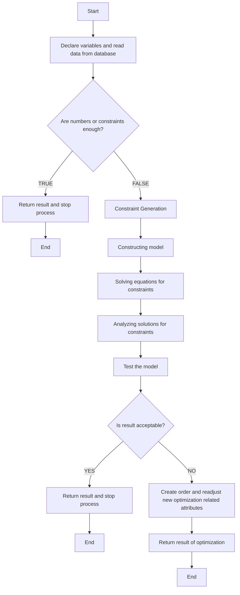

### **Apraksts:**
1. **Start** - Algoritma sākuma punkts.
2. **Declare variables and read data from database** - Datu nolasīšana un sākotnējo mainīgo definēšana.
3. **Are numbers or constraints enough?** - Pārbauda, vai dati un ierobežojumi ir pietiekami.
4. **Constraint Generation** - Ģenerē ierobežojumus, ja nepieciešams.
5. **Constructing model** - Izveido matemātisko modeli.
6. **Solving equations for constraints** - Rēķina vienādojumus, balstoties uz ierobežojumiem.
7. **Analyzing solutions for constraints** - Analizē risinājumus un validē tos.
8. **Test the model** - Pārbauda, vai modelis darbojas kā paredzēts.
9. **Is result acceptable?** - Pārbauda, vai rezultāts ir pieņemams.
10. **Create order and readjust new optimization related attributes** - Veido jaunus atribūtus, ja nepieciešams.
11. **Return result of optimization** - Atgriež optimizācijas rezultātus.
12. **End** - Algoritma beigas.

### **Piezīmes:**
- Diagramma atspoguļo loģisko algoritma modeli ar datu pārbaudi un optimizācijas soli.
- Optimizācijas process tiek veikts, balstoties uz ieejas datiem un ierobežojumiem.
