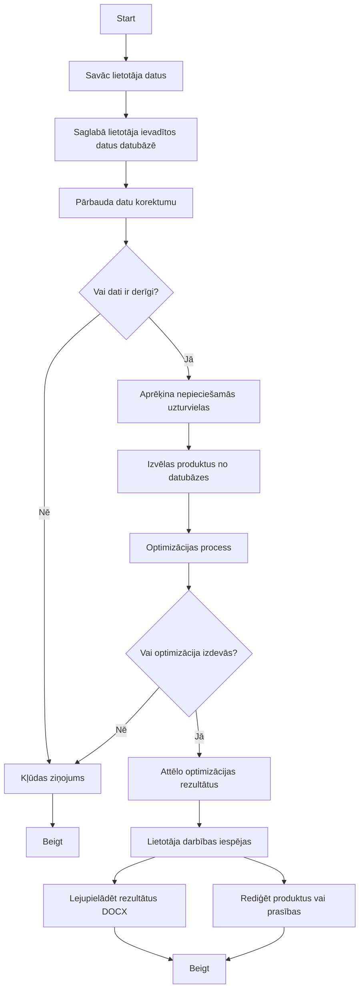

### **Apraksts:**
1. **Start** - Algoritma sākuma punkts.
2. **Savāc lietotāja datus** - Ievada vecumu, dzimumu, svaru, augumu, produktu prasības, uzturvērtību ierobežojumus un budžetu.
3. **Saglabā datus datubāzē** - Ievadītie dati tiek uzglabāti datubāzē.
4. **Pārbauda datu korektumu** - Verificē ievadīto datu pareizību un pilnīgumu.
5. **Vai dati ir derīgi?** - Pārbauda, vai dati atbilst prasībām.
6. **Kļūdas ziņojums** - Ja dati nav derīgi, atgriež kļūdu un pārtrauc algoritmu.
7. **Aprēķina nepieciešamās uzturvielas** - Nosaka uzturvielu daudzumu un robežas.
8. **Izvēlas produktus no datubāzes** - Atrod produktus, kas atbilst uzturvērtību un cenu prasībām.
9. **Optimizācijas process** - Izmanto lineāro programmēšanu, lai atrastu optimālo produktu kombināciju.
10. **Vai optimizācija izdevās?** - Pārbauda, vai optimizācija bija veiksmīga.
11. **Attēlo optimizācijas rezultātus** - Parāda optimizēto ēdienkarti ar grafikiem un kopējām izmaksām.
12. **Lietotāja darbības iespējas** - Lejupielāde vai rediģēšana.
13. **Beigt** - Algoritma beigas.

### **Piezīmes:**
- Diagramma attēlo loģisko algoritma modeli no datu ievades līdz rezultātu attēlošanai.
- Izmanto lineārās programmēšanas algoritmu uzturvielu un izmaksu optimizācijai.
